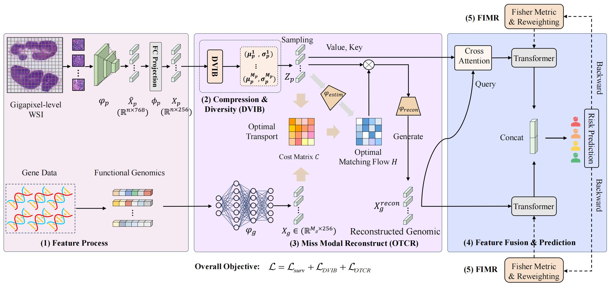

# MCSP-OTMR

Official implementation of **MCSP-OTMR: Multimodal Cancer Survival Prediction with Optimal Transport-based Missing Modality Reconstruction**.

<p align="center">
  
</p>

## Introduction
Multimodal data integration, particularly the joint modeling of histopathology images and genomic profiles, offers significant potential for advancing cancer survival prediction. However, several pressing challenges hinder its progress: (1) gigapixel-level whole-slide images (WSIs) contain substantial redundancy and noise, complicating discriminative feature extraction; (2) missing modalities are common in clinical settings, yet most existing models assume full data availability, limiting real-world applicability; and (3) inherent disparities in information density between pathology and genomics often lead to modality imbalance and gradient conflicts, thereby degrading model performance. To address these issues, we propose MCSP-OTMR, a novel multimodal cancer survival prediction framework based on optimal transport reconstruction and modality reweighting. Our contributions are mainly reflected in three aspects. First, we employ a differential variational information bottleneck (DVIB) module to reduce redundancy and extract discriminative features from pathological images. Second, we design a novel optimal transport-based cross-modal reconstruction (OTCR) module to align inter-modal distributions and enable semantic completion, enhancing the model's robustness to missing modalities. Third, we design a Fisher information-guided modality reweighting (FIMR) strategy that dynamically adjusts optimization gradients according to each modality's task relevance, alleviating modality imbalance and facilitating more effective joint learning. Extensive experiments on four public TCGA cancer datasets demonstrate that our method consistently surpasses state-of-the-art baselines under both complete and missing modality settings. Furthermore, interpretability analyses performed on pathological and genomic inputs reveal clinically meaningful prognostic patterns, underscoring the practical value of our approach.



## Data Preparation

### WSIs

1. Download the original WSI data from [TCGA](https://portal.gdc.cancer.gov/).
2. Preprocess WSIs and extract patch-level features with [CLAM](https://github.com/mahmoodlab/CLAM), CTransPath, or another compatible feature extractor.

The expected feature directory structure is:

```text
DATA_ROOT_DIR/
    pt_files/
        slide_1.pt
        slide_2.pt
        ...
```

### Genomics

The cleaned survival metadata and genomic signature files are provided under:

```text
dataset_csv/
datasets_csv_sig/
splits/
```

## Requirements

```bash
conda create -n mcsp-otmr python=3.9
conda activate mcsp-otmr
pip install -r requirements.txt
```

The OTCR module depends on the Python Optimal Transport package, imported as `ot`.

## Usage

The current main training entry is:

```bash
CUDA_VISIBLE_DEVICES=<CUDA_IDX> python main.py \
  --split_dir <TCGA_DATASET> \
  --data_root_dir <WSI_FEATURE_DIR>
```

For example, `<TCGA_DATASET>` can be `tcga_brca`, `tcga_gbmlgg`, `tcga_luad`, or `tcga_ucec`, matching the folders under `splits/5foldcv/`.

## Acknowledgement

This implementation builds on commonly used multimodal survival prediction components and feature preprocessing tools. We thank the following repositories:

- [CLAM](https://github.com/mahmoodlab/CLAM)
- [CTransPath](https://github.com/Xiyue-Wang/TransPath)
- [MCAT](https://github.com/mahmoodlab/MCAT)
